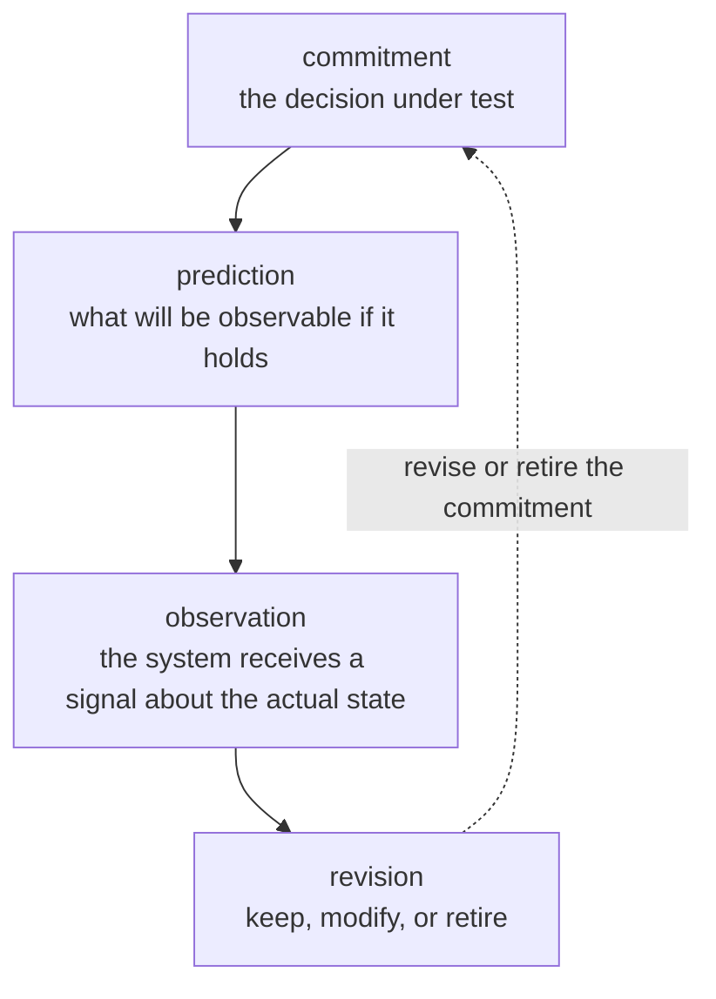

# Axiom A1 — Feedback

> A commitment that the world cannot check is not a commitment. It is a
> wish. Math-coding's second principle is the closure of every
> commitment loop.

## Statement

For every commitment in the system, there exists a *path* by which the
world tells the system whether the commitment holds.



The loop is closed iff every commitment has at least one path to an
observation.

## What this axiom forbids

- A `Decision` whose `outcomes` are not *observable*. An outcome must be
  something the system or a person can read.
- A `Decision` whose `reversal` is `impossible` *without* an alternative
  containment plan. Irreversibility is allowed; unflagged
  irreversibility is not.
- An `Attestation` whose `result` is reported as `pass` when no test,
  review, or observation has actually run. ("Green CI" with no CI is a
  failure mode.)
- A `Waiver` that does not expire. Waivers defer a check, they do not
  cancel it.
- A `Revision` that erases history. Revisions add; they do not delete.

## Where this axiom lives in the codebase

- `spec/constitution.md` — invariants 8 (Evidence binding), 11 (Waiver
  bounds), 14 (Honest status).
- `spec/semantics.md` — Pass / Fail / Inconclusive are distinct states.
- `spec/semantics.md` — `absence_means: inconclusive` is allowed for
  operational outcomes; absence never means pass.
- `lib/domain.ml` — `result` variant includes `Inconclusive` and
  `InfrastructureError` distinctly from `Pass`.
- `schemas/attestation.json` — `result` enum.
- `OCAML_BEST_PRACTICES.md` §1.3 — kernel stays offline so that
  observations can be replayed deterministically.

## Formalization

The honest-uncertainty result type and the gate-phase schedule live
in [`spec/algebra-3.2.md`](../spec/algebra-3.2.md) §0
("Honest uncertainty principle (A1-derived)") and §15
("Gate verdict (phase-aware)").

The result of an attestation is one of four distinct values; the
absence of an attestation is itself a fifth value, never aliased to
Pass:

```text
result(c) ∈ {Pass, Fail, Inconclusive, InfrastructureError}
Pass ≠ Fail ≠ Inconclusive ≠ InfrastructureError
absence(c) ⟹ c is Inconclusive, never Pass
```

An obligation is enforced at the phase declared on the obligation
itself; `pre_merge` blocks the merge gate, `pre_release` blocks the
release gate, and `post_release` is monitoring-only (it never blocks
either gate, but emits an `AssuranceGap` when violated). The
per-phase remedy sets are distinct:

```text
phase(pre_merge)    : {add_trailer_ref, create_sibling_yaml, downgrade_mode}
phase(pre_release)  : {supersede_decision_per_impact_list, add_release_attestation}
phase(post_release) : informational only, no block
```

The invariant \( \text{exit} \neq 0 \land \text{remedies} \neq \varnothing \)
(algebra §15, marked I14 in §19) restates the prose: every blocked
merge must name at least one authorized remedy.

## Counter-example that would violate this axiom

A `Decision` whose `outcome` is "the system is high-quality". Without an
observer, this is a wish. The agent must either:

- replace the outcome with a measurable property (latency, error rate,
  coverage, etc.); or
- document the outcome as `unobservable` and refuse to gate on it.

## Counter-example that would silently violate this axiom

A `Waiver` with `expires_at` set in the past. The waiver is technically
defined but operationally meaningless. The kernel must treat an
expired waiver as not granted (see A2).

## What an agent must do when the axiom seems to fail

1. Identify the missing link in the loop (no observation, no
   reversal, no expiration).
2. Propose an explicit fix: a measurement, an alert, a rollback path,
   or an expiry.
3. If the missing link is *intentional* (e.g., a decision that cannot
   be measured), record the decision as `unobservable` and gate only on
   observable side effects.
4. Do not present `unobservable` outcomes as if they were verified.
