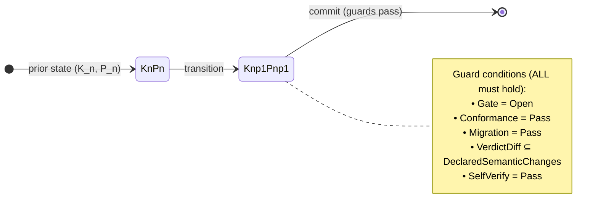

# Axiom A3 — Self-application

> A convention that does not apply to itself cannot be trusted. The
> fourth principle is recursive: the rules that govern the system also
> govern the rules.

## Statement

For every transition of the system's governing rules

```text
(K_n, P_n) -> (K_{n+1}, P_{n+1})
```

the transition MUST satisfy:



```text
Gate_{K_n, P_n}(transition) = Open
Conformance(K_{n+1}) = Pass
Migration(K_n, K_{n+1}) = Pass
VerdictDiff(K_n, K_{n+1}) subset DeclaredSemanticChanges
SelfVerify(K_{n+1}, P_{n+1}) = Pass
```

In particular:

- `P_{n+1}` MUST NOT contribute to the authorization of its own
  adoption.
- The kernel `K_{n+1}` MUST NOT weaken any protected constitution rule
  in the same transition that adopts it.
- A migration that does not round-trip on the conformance corpus is
  rejected.

## What this axiom forbids

- A policy change that lowers the minimum tier floor for an existing
  risk trigger in the same release.
- A constitution change that removes the "exit honesty" invariant
  in the same release that adopts the change.
- A kernel change that disables an attestation verification method
  used by existing decisions, without a migration that re-establishes
  the verification.

## Where this axiom lives in the codebase

- `spec/constitution.md` — invariant 12 (Prior authority), invariant
  13 (Fixture coverage).
- `spec/semantics.md` — Protected Policy Transition section.
- `decisions/decision.yaml` — obligations include `conformance-coverage`
  and `developer-practices-binding`, both of which must pass under the
  *current* rules before the next rules take effect.
- `OCAML_BEST_PRACTICES.md` §10 — adapter conventions explicitly forbid
  adapters from weakening kernel invariants.

## Formalization

The transition guard, the three-valued status, and the
`max_verdict` ordering live in
[`spec/algebra-3.2.md`](../spec/algebra-3.2.md) §15 ("Gate verdict"),
§17 ("Inline axiom change"), and §20 ("Kernel rules") respectively.

The merge gate is *Open* when every pre-merge obligation is `Pass`
and no kernel rule rejects the commit; otherwise the gate is
`Blocked`:

```text
gate_merge(c, p, t, rules):
  Open iff ∀ ob ∈ blocking_obligations(c): result(ob) = Pass
        ∧ ∀ r ∈ rules: apply(r, c, t)
        ∧ re_evaluation_status(c) ≠ StaleClaim
  Blocked otherwise
```

An axiom revision (algebra §17) re-evaluates every decision whose
obligations cite the old axiom's forbidden patterns. The status is
one of three values; ordering matters because the kernel combines
per-decision statuses by taking the maximum:

```text
re_evaluate: Decision × AxiomRevision → ReEvaluationStatus
re_evaluate(d, A_new):
  - ob.claim references A_old.forbidden_patterns → StaleClaim
  - ob.acceptance.verifier is test-style → run, return Compatible on Pass
  - ob.acceptance.verifier is manual-style → Inconclusive

max_verdict: Compatible < Inconclusive < StaleClaim
```

The total order means a single `StaleClaim` blocks the entire
release regardless of how many `Compatible` decisions exist (algebra
§17). This is the formal counterpart of the prose rule "P_{n+1}
MUST NOT contribute to the authorization of its own adoption".

## Counter-example that would violate this axiom

A change to `policy.yaml` that drops the rule "every kernel-enforced
MUST has positive and negative fixtures" while also adopting the new
kernel that does not yet have those fixtures. The new policy would
adopt a kernel that violates the old policy's invariant 13.

The fix: either (a) the new kernel ships with the fixtures before the
rule drops, or (b) the rule drops in a later release, after the kernel
has matured.

## Counter-example that would silently violate this axiom

A waiver granted for a transition that bypasses the prior authority
because the policy that authorized the transition was the same one
being changed. This is a circular authorization and is precisely what
A3 forbids.

## What an agent must do when the axiom seems to fail

1. Identify which prior-authority rule would be violated by the
   proposed transition.
2. Split the change into two PRs:
   - PR 1: change the policy under the old authority.
   - PR 2: change the kernel under the new policy.
3. If the change cannot be split (the policy and the kernel are
   entangled), request an explicit protected-policy transition with
   delayed activation.
4. Never ship a single commit that changes both `policy.yaml` and
   the kernel in a way that weakens an invariant.
