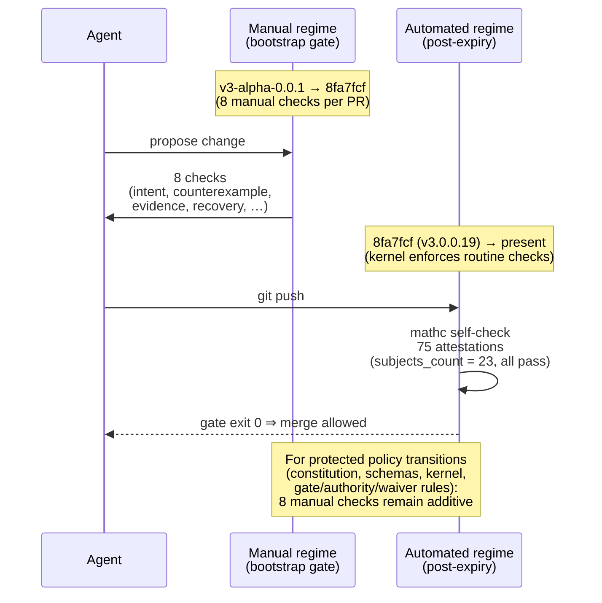

# Bootstrap gate

> The bootstrap gate is the transition between **manual
> declarations** and **automated guarantees** for the kernel's
> verdicts. This page is the public record of that transition.

## The problem

A kernel that has not been shown to work is a traffic-light
painted on a rock. Until the released 3.0 kernel successfully
checks this repository and its conformance corpus, the kernel's
verdicts are *manual declarations*. They might be honest, but
they are not enforced.

Math-coding 3.0-alpha began life in that state. From the first
commit (`v3-alpha-0.0.1`, 26 Sep 2026) to the moment the gate
expired (commit `8fa7fcf`, 29 Sep 2026), every change had to
satisfy eight manual checks:

- the intended behavior and affected capabilities are explicit;
- known invariants are preserved or deliberately revised;
- the strongest relevant counterexample has been considered;
- planned evidence is available or its absence is declared;
- every known blocking deficit has a remedy;
- rollback or forward recovery exists for irreversible work;
- specification changes include positive and negative fixtures;
- no automated guarantee is claimed.

These checks are not removed when the gate expires. They remain
*additive* obligations for protected policy transitions (changes
to the constitution, schemas, canonicalization, kernel, gate
rules, authority rules, or waiver rules). For routine work —
the 95% of practical cases — the kernel decides; humans review.

## The expiry

The gate expired at commit `8fa7fcf` (v3.0.0.19). Concretely:

- `mathc self-check` is a blocking CI step. On a clean `main` HEAD
  the step prints `self-check exit=0` and the JSON payload
  contains `verdict=pass`, `subjects_count=23`,
  `pass_count=23`. PRs that yield `fail` (exit 1) or
  `unknown` (exit 3) block the merge.
- The attestation store at `attestations/` contains 75 JSON
  files — one per decision-obligation pair enumerated by
  `scripts/generate-attestations.py`.
- `mathc gate BASE HEAD` reports verdicts against the populated
  store: `gate-pass.t`, `gate-fail.t`, `gate-stale.t` are
  green.

From this commit forward, **assessment verdicts produced by
`mathc gate`, `mathc self-check`, and `mathc assess` are automated
guarantees, not manual declarations**.

## The eight checks, post-expiry

For protected policy transitions the eight manual checks remain
binding. They are documented in `AGENTS.md §Self-application` and
governed by axiom A3 (the rules govern their own changes). The
kernel enforces routine checks automatically; humans enforce
constitutional ones. The two regimes coexist.

## What this site is

This site is the first artifact the kernel produced **after**
the gate expired. Every page on it is rendered by `mathc render`
from source files under `site/`. The package grid on
[index.html](index.html) is the live output of
`mathc packages --format=html`. The methodology page
([methodology.html](methodology.html)) describes the discipline
that the kernel enforces; the kernel enforces it on the site
that describes it. This is A3, applied.